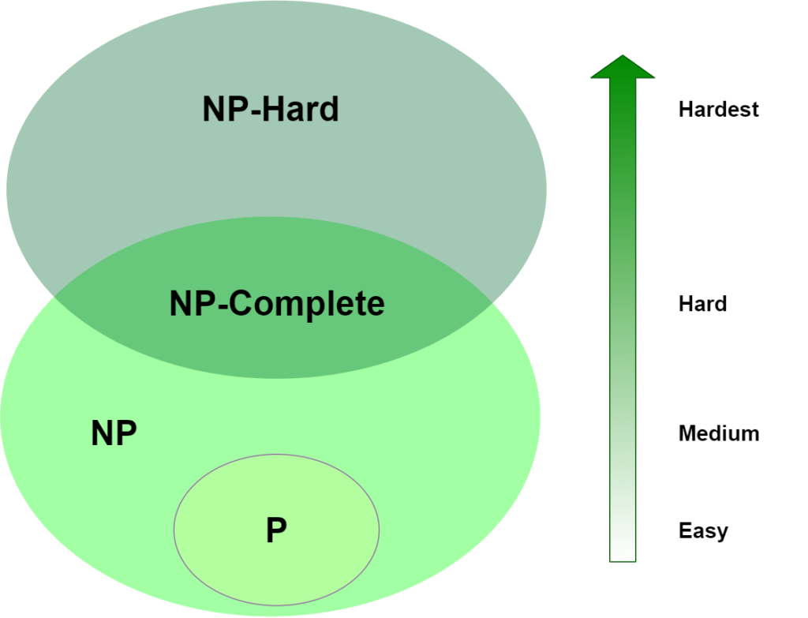
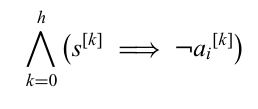

**The Task-Motion Kit An open source , general-purpose task and motion planning framework**

|                | The Task-Motion Kit An open source <br />2018 Dantam, Kavraki et al. |
| -------------- | ------------------------------------------------------------ |
| **Aim**        | offer a general-purpose task and motion planning framework<br />TMKit is an end-to-end, probabilistically complete TMP and real-time execution<br />allow interaction btw. task planning and motion planning |
| **Background** | standalone task-motion planning doesn't work well<br />      |
| **Methods**    | <br />interaction btw. task planner and motion planner through `domain semantics`<br />, in which two types of functions are necessary. i) a function mapping from scene graph to a discrete state, ii) a function mapping from discrete task planning to continuous motion plan |
| **Conclusion** | general-purpose and extensible framework;<br />can be generalised across hardware platform, task domains and TMP algorithms |
| **Comments**   | TMP framework                                                |


|                | extended task and motion planning of long-horizon robot manipulation<br />Ren, Chalvatzaki, Peters |
| -------------- | ------------------------------------------------------------ |
| **Aim**        | challenges of hierarchical TAMP: missing the knowledge about the environment at the symbolic level<br /> |
| **Background** | monte-carlo tree search(MCTS), <br />top-k planning, used to construct a skeleton space<br />PDDLStream, which arguments the skeleton planner, including motion-planner and pose-sampler? |
| **Methods**    | two-folds contribution of this article: 1. transform the incomplete domain description into a series of generic planning problems, which can be solved by any top-k planners; 2. solve resultant decision-making problem with tree-structured search algorithm<br />making decision on extended decision spaces over plan skeletons and action parameters<br />top-k planner constructs a skeleton space, where skeleton planner generates a variety of skeleton candidates<br />combining skeleton space with **motion parameter spaces?** into the extended decision space<br />MCTS ensure the balance of exploration-exploitation: selection, expansion, simulation and backup<br /> |
| **Conclusion** |                                                              |
| **Comments**   |                                                              |


|             | Incremental task and motion planning: a constraint-based approach<br />2016 Dantam, Kavraki et al. |
| ----------- | ------------------------------------------------------------ |
| aims        |                                                              |
| methods     | iteratively deepend task and motion planning (**IDTMP**)<br />leverage incremental constraints solution, to efficiently add and remove constraints on motion feasibility at the task level, with the help of the incremental solution capabilities of Satisfiability Modulo Theories (**SMT**) |
| conclusions |                                                              |
| comments    |                                                              |


|             | an incremental constraint-based framework for task and motion planning<br />Dantam, Kavraki et al. |
| ----------- | ------------------------------------------------------------ |
| aims        |                                                              |
| methods     |                                                              |
| conclusions |                                                              |
| comments    |                                                              |


|             | an incremental constraint-based framework for task and motion planning<br />Dantam, Kavraki et al. |
| ----------- | ------------------------------------------------------------ |
| aims        |                                                              |
| methods     |                                                              |
| conclusions |                                                              |
| comments    |                                                              |


|             | an incremental constraint-based framework for task and motion planning<br />Dantam, Kavraki et al. |
| ----------- | ------------------------------------------------------------ |
| aims        |                                                              |
| methods     |                                                              |
| conclusions |                                                              |
| comments    |                                                              |


### A. RandomReading

#### Multi-arm bandit problem and bandit algorithms

idea comes from the slot machine, you may get specific reward by pulling an arm. the key for bandit algorithms is to find a balance btw. exploration and exploitation

| concepts           | description                                                  |
| ------------------ | ------------------------------------------------------------ |
| action space       | number of arms, that you can choose, <br />finite vs infinite<br />single action vs combinatorial actions(a vector of actions) |
| structured problem | take action and got some information, if the information reveal some information about actions that you don't play, structured information; if no, unstructured problem.<br />structured problem means, connection btw. actions |
| context            | take specific action under different context                 |
| reward             | stochastic: each action corresponds to an IID reward; the reward don't change over time<br />non-stationary: reward distribution shifts over time; relaxation of stochastic with a cost<br />adversarial: use worst-cast results that will throw off a learner |
| feedback           | when or how much does the learner receive reward<br />full feedback: the learner observes all of the action reward<br />bandit feedback: the learner observes only the reward of selected action<br />partial feedback: observes the cumulative reward of action; make sense in combinatorial setting |
|                    |                                                              |

**Ref:**

- [a roadmap to multi-arm bandit algorithms](https://towardsdatascience.com/a-roadmap-to-multi-arm-bandit-algorithms-a5a074d41a24)
- [reinforcement learning - multi-arm bandit implementation](https://towardsdatascience.com/reinforcement-learning-multi-arm-bandit-implementation-5399ef67b24b)


#### Monte carlo tree search(MCTS)

- **selection**, starting from root node $R$, select child node with biggest estimated value, but also consider balance btw. exploration and exploitation using upper confidence bound for trees(UCT), select successively until leaf node $L$ is reached
- **expansion**, choose one valid child node $C$ of $L$ unless L ends the game decisively, **why?**
- **simulation**(playout), playout the game from node $C$
- **backpropagation**, update value on the path from $C$ to $R$


#### Multi-modal path planning

for instances, humanoid robot has multiple modes to interact with object, like grasp, push, reach, walk, path planning using all listed possible modes, we call it multi-modal path planning

ref: Multi-modal motion planning for a humanoid robot manipulation task


#### [P, NP, NP-complete, NP-Hard](https://www.baeldung.com/cs/p-np-np-complete-np-hard)

P: polynomial time

NP: non-deterministic polynomial time, cannot be solved in polynomial time but can be verified in polynomial time

NP-complete, complete NP problem, can be transformed into another NP-complete problem in polynomial time

NP-hard, cannot be solved and verified in polynomial time



#### PSpace

a set of decision problem, which can be solved by Turing machine using a polynomial amount of space

#### voronoi sampling?

sampling as uniform as possible, e.g. the extension of nodes in RRT

[voronoi diagram](https://en.wikipedia.org/wiki/Voronoi_diagram)

- partition the plane into several regions based on specific seeds points. each region contains a seed,  and all points inside the region is closer to its seed than any other seed

  

- 

### B. Algorithms and its Design Paradigm

#### [min-max algorithm](https://en.wikipedia.org/wiki/Minimax#Minimax_algorithm_with_alternate_moves)

- a common used tree search algorithm for two-players game, each named maximisingPlayer and minimisingPlayer
- maxmisingPlayer aims to find a best move which maximise its value on current node
- minimizingPlayer work as the opponent of maximisingPlayer, thus to find a worst move for maximisingPlayer which also best move for himself to minimizing estimated value of current node
- because of the limit of time and space complexity, the search tree is usually limited to specific depth. The **heuristic value estimator** works for scoring the leaf node of the search tree. 
- belongs to **branch-and-bound**

```python
def function minimax(node, depth, maximizingPlayer):
    if search terminate or depth==0:
        return heuristicEstimator(node)
	if maximizingPlayer:
        value = -infinity
        for child in all_childs:
        	value = max(value, minimax(child, depth-1, False))
        return value
    else: # minimizing player
        value = +infinity
        for child in all_childs:
            value = min(value, minimax(child, depth-1, True))
        return value
	
# initial function call
minimax(origin_node, 10, True)
```


#### [alpha-beta pruning](https://en.wikipedia.org/wiki/Alpha%E2%80%93beta_pruning)

- pruning the search tree of [minimax algorithm](#min-max algorithm) by the use of the two bounds $\alpha$ and $\beta$
- updating the two bounds alongside searching

```python
def function minimax(node, depth, alpha, beta, maximizingPlayer):
    if search terminate or depth==0:
        return heuristicEstimator(node)
	if maximizingPlayer:
        value = -infinity
        for child in all_childs:
        	value = max(value, minimax(child, depth-1, alpha, beta, False))
            if value>beta:
                break
            # update alpha
            alpha = max(alpha, value)
        return value
    else: 
        value = +infinity
        for child in all_childs:
            value = min(value, minimax(child, depth-1, alpha, beta, True))
            if value<alpha:
                break
            # update beta
            beta = min(beta, value)
        return value

# initial function call
minimax(origin_node, 10, -infinity, +infinity, True)

```


#### anytime algorithm / anytime behaviour

- algorithm which can be interrupted at any time and return a rational solution
- if the algorithm can run any longer, it'll return a better or optimal solution


#### branch-and-bound

is not an algorithm, but a general methods or an algorithm design paradigm

branch: branches of tree, representing the subset of the solution set

bound: in order to prune the tree and decrease the search space, *upper or lower estimated bound*

branching factor, means how many sub-branches of a node has in average


#### divide-and-conquer

an algorithm design paradigm

**divide** the original problem into subproblem iteratively, unitl the final subproblems are simple enough to solve directly

**conquer** all the subproblems to give a solution to the original problem


#### Linear temporal logic (LTL)


### C. Task Planing


#### IDA-Star

iterative deepening A*

graph traversal and path search algorithm, finding optimal solution from random start node to the given goal node, general solver for puzzles, rubik's cube and sokoban etc.

borrow the idea from A*, which use heuristic search to evaluate cost from current node to the goal node


#### Task plan methods

- IDA-Star, optimal planning
- LRTA-Star, real time planning
- GraphPlan
- SatPlan, planning as satisfiability problem
- heuristic search planning (HSP): best first search + heuristic function
- Fast forwards (FF), enforced hill climbing + heuristic function from graph
- Fast downwards (FD), multi-valued planning task + casual graph heuristics

#### IDA-Star


#### Planning as Satisfiability SAT<a href=#c2>[c2]</a>

given, an instance of a planning problem with given initial state, a set of operators, set of goal states, and a horizon length<a href=#c3>[Satplan]</a>

generated, a **formula?** so that the formula is satisfiable only if there is a plan inside the given horizon length

#### Satisfiability Module Theory (SMT)


#### Hierarchical Task Network (HTN)<a href=#c1>[c1]</a>

- decompose the initial (big) task or initial task network into a hierarchical task network 
- the task network is [partial-order planning](https://en.wikipedia.org/wiki/Partial-order_planning), containing only the primitive sub-tasks


### D. Motion Planning


### E. Task Motion Planning

#### Problem Description

##### [STRIPS](https://en.wikipedia.org/wiki/Stanford_Research_Institute_Problem_Solver)

- formal language to describe planning problem
- consists of 4 parts (P, O, I, G)
  - conditions or propositional variables
  - actions or operators
  - initial state
  - specification of goal state

##### [ADL](https://en.wikipedia.org/wiki/Action_description_language)

##### [PDDL](https://en.wikipedia.org/wiki/Planning_Domain_Definition_Language)

- define `domain` and `problem` seperately
- `domain` describes `predicates` and available `actions`
- `problem` describes the scenario explicitly, including `domain` `objects` `init` `goal`

###### PDDL 1.2

- domain: `predicate`,`object` `action`
- logic AND OR NOT imply?

###### PDDL2.1

- introducing `time` and `number`
- new type of action, `durative action`,  it introduces a duration parameter which models the length of time an action takes, create three points at start, duration and end of action
- `numeric fluent`, allowing to model the subsequent consumption of resources

###### PDDL2.2

- adding `derived predicates` and `timed initial literals`
- `derived predicates` also known as axioms, allowing us to define resuable predicates
- `timed initial literals` means initial predicates happens not at the beginning of the plan but in the future

###### PDDL3.0

- `soft constraint`, perfect to have something but also okay without it, work with a cost to quantify the performance

###### PDDL+

- `process` always happen when its predicates are true, e.g. ball keep falling when it's release from hand
- `event` happen only once when its predicates are true, e.g. direction changes when ball hit the wall

##### PDDLStream

- 

##### Semantic Attachment<a href=#ea0>[ea0]</a>

- a way to add more extra information/**modules** into PDDL, call as PDDL/M

- goal of the extended module imported by semantic attachment work as a standalone functional package

- semantic attachment composes of two parts: `declarative part` and `procedural part`

  - former declare the function of the module in PDDL 
  - latter is the algorithm which realizes the function of this module

- two kinds of modules `module condition` and `module effect`, e.g. 


#### TAMP Benchmarking <a href=#e1>[e1]</a>

benchmarking problems in three perspectives:

- logical 
- geometrical
- dependency

the range of tamp problems

- geometric vs dynamic
- fully vs partially observable
- deterministic vs non-deterministic
- single-agent vs adversarial vs collabrative

criteria on the difficulty of tamp problems

- large task space
- infeasible task actions
- motion/task trade off
- non-monotonicity
- non-geometric actions

#### aSyMov<a href=#e2>[e2]</a><a href=#e3>[e3]</a>

- Metric-FF + PRM

- task planner select state and compute applicable actions
- compute cost and select an action and validate if the action is geometrically executable
- if yes, search state more deeply; 
- if not, extend the roadmap and try it again or increase cost of the current state

- motion planning use two kinds of roadmap, e.g. transit roadmap(ungrasp) and transfer roadmap(grasp)


#### eTAMP<a href=#e4>[e4]</a>

- PDDLStream + Top-k planner + Monte Carlo Search Tree(MCTS)
- symbolic `top-k planner` find top-k candidate `action plan`
- instantiate the `action plan`  to `skeleton` by using `stream`
- MCTS search for concrete bindings?


#### IDTMP<a href=#e5>[e5]</a>

- iteratively deepened task and motion planning or incremental task and motion planning
- incremental SMT solver Z3 + RRT_Connected


### Experiment

IDTMP, mapping from task space to motion space, IDTMP sample a position randomly not in the total continuous space,  but in a specific resolution, it's resolution complete, e.g. see the log file of `block world` problem. Problems of this solution is:

1. when resolution is set too small, too large solution space and computational expensive. And when find a valid solution depends on how the SMT solver each time chooses the candidate solution. ideally if SMT solver choose candidate solution **randomly**, but actually it's not.
2. when resolution too big, maybe no solution

Currently available `RRTConnect` find a path in configuration space, it leads to weird trajectory of manipulator TCP or grasped object. Because sometimes I want the to be moved grasped object (like a glass of wine) to keep horizontally along the full path. At least two possible solution are proposed as below:

1. add extra constraints to `RRTConnect` planner, but where?
2. write your own planner which do sampling in cartesian space

### Implementation

#### Framework


data flow


**problem** of the second version of adding constraint - general state+action component , which are added when motion refining failed.

1. when adding failed state-action components as global constraints, algorithm not complete. because motion refining failure was caused not 100% due to no motion solution but sampling time-out.
2. the same state in state-action component programmed by boolean variables may actually refer to different state in real world. In other words, two states, e.g. robot grasp box from top or side, may be programmed as same state(depending on the defining domain), and for one state there is candidate action to execute, but for another there is not.




### Problem

- [ ] what's the relation btw. number steps in log file and number of action sequences, 
  - not equal
  - iteratively deepened steps, but shorter action sequences was found for the given deep steps
  - guessing, $n$ step means maximal $n+1$ actions sequence 
- [ ] currently when specify `A` on top of `B` in *.robray, means defaultly `A` on $(0,0)$ position of `B`, how to change it?
- [ ] duplicate candidate solution? see `regrasp/log/plan11.log`
  - duplicate for different steps, may save failed solutions in set,in order to avoid checking same solution latter 
- [ ] There is still com valid solution in step 2 phase, but SMT solver could not find it in time and then jump to deeper step


### Reference

- <a name="c1">c1 </a>2018 UUlm Tutorial -- an introduction to HTN planning
- <a name="c2">c2 </a> 2012, Rintanen, SAT Planning as satisfiability -- Heuristics
- <a name="c3">SatPlan </a> https://en.wikipedia.org/wiki/Satplan
- <a name="e1">e1 </a>2016, Lagriffoul, On Benchmarks for Combined Task and Motion Planning
- <a name="e2">e2 </a>2005, Gravot, aSyMov: A Planner That Deals with Intricate Symbolic and Geometric Problems
- <a name="e3">e3 </a>2004, Cambon, aSyMov A Robot Task Planner that Merges Symbolic and Geometric Reasoning
- <a name="e4">e4 </a>2021, Ren, Extended Task and Motion Planning of long-horizon Robot Manipulation
- <a name="e5">e5 </a>2018, Dantam, An incremental constraint-based framework for task and motion planning
- <a name="ea0">ea0 </a>2009, Dornhege, Semantic Attachments for Domain-Independent Planning Systems
- <a name="e4">e4 </a>
- <a name="e4">e4 </a>
- <a name="e4">e4 </a>
- <a name="e4">e4 </a>
- <a name="e4">e4 </a>
- 

### TODO

- [x] IDTMP add **new constraint** to constraint stack when motion planning failed, but how this new constraint will influence the next generated skeleton, too strict or too loose, maybe you can compare it with the skeletons of eTAMP
- [x] weird constraint added by IDTMP
- [x] date for intermediate and final thesis defence
- [x] pddl planner ??
- [x] add extra pick-up direction in z-axis: 
- [x] convert py2 to py3, ~/tamp/idtmp/tmp, almost...
- [x] OMTPlanner not able to encode grammar like OR in goal of problem.pddl
- [ ] task_cook not implemented
- [ ] update add_motion_constraints
