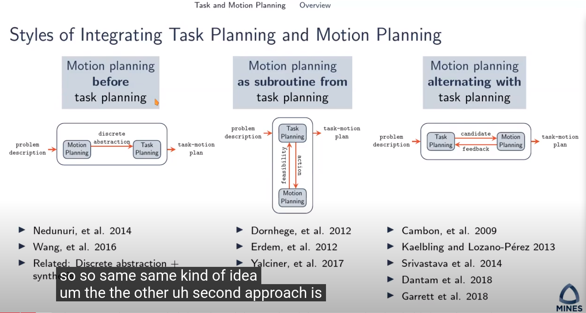
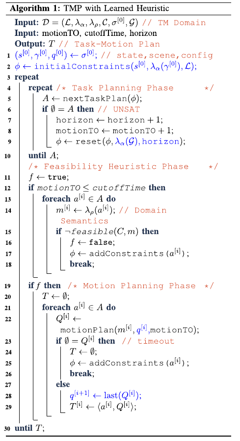
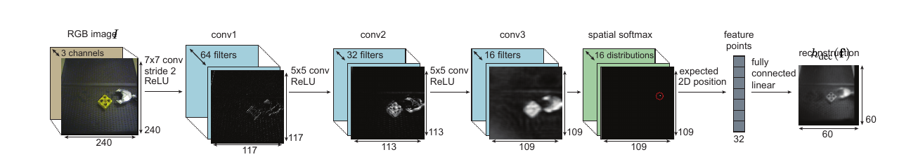
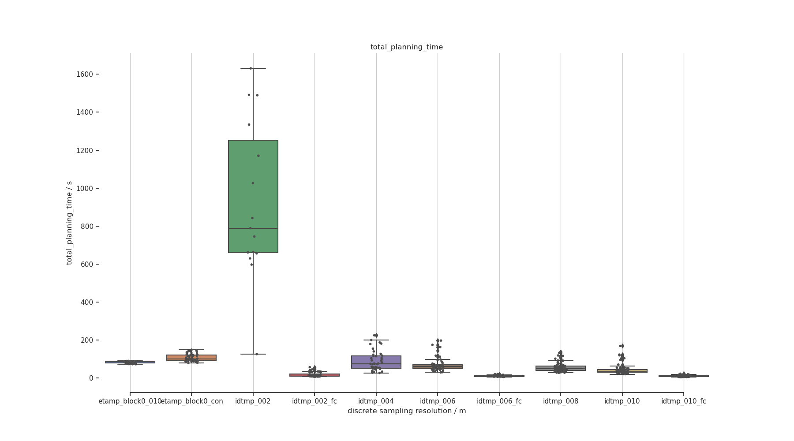
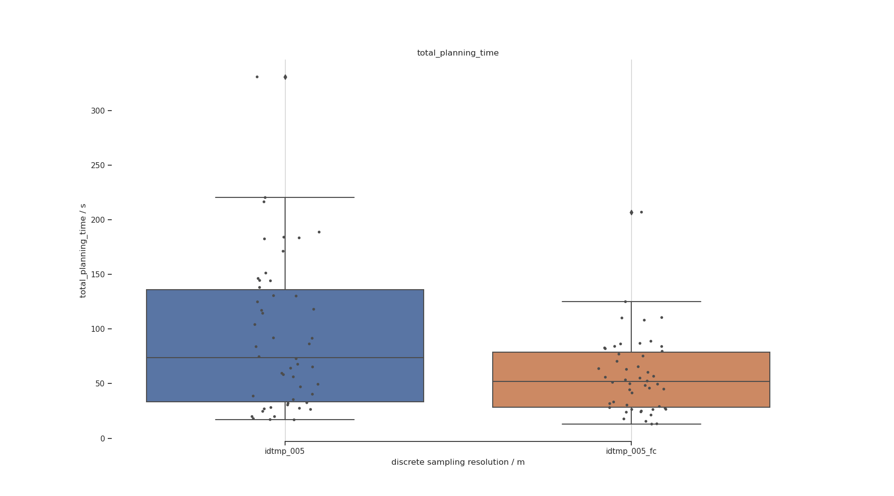
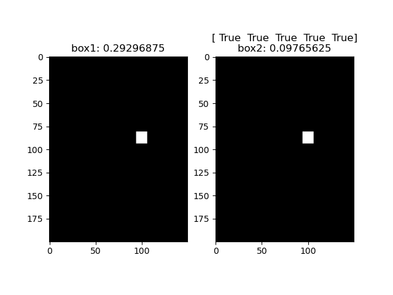

##### 

**The Task-Motion Kit An open source , general-purpose task and motion planning framework**

|                | The Task-Motion Kit An open source <br />2018 Dantam, Kavraki et al. |
| -------------- | ------------------------------------------------------------ |
| **Aim**        | offer a general-purpose task and motion planning framework<br />TMKit is an end-to-end, probabilistically complete TMP and real-time execution<br />allow interaction btw. task planning and motion planning |
| **Background** | standalone task-motion planning doesn't work well<br />      |
| **Methods**    | <br />interaction btw. task planner and motion planner through `domain semantics`<br />, in which two types of functions are necessary. i) a function mapping from scene graph to a discrete state, ii) a function mapping from discrete task planning to continuous motion plan |
| **Conclusion** | general-purpose and extensible framework;<br />can be generalised across hardware platform, task domains and TMP algorithms |
| **Comments**   | TMP framework                                                |


|                | extended task and motion planning of long-horizon robot manipulation<br />Ren, Chalvatzaki, Peters |
| -------------- | ------------------------------------------------------------ |
| **Aim**        | challenges of hierarchical TAMP: missing the knowledge about the environment at the symbolic level<br /> |
| **Background** | monte-carlo tree search(MCTS), <br />top-k planning, used to construct a skeleton space<br />PDDLStream, which arguments the skeleton planner, including motion-planner and pose-sampler? |
| **Methods**    | two-folds contribution of this article: 1. transform the incomplete domain description into a series of generic planning problems, which can be solved by any top-k planners; 2. solve resultant decision-making problem with tree-structured search algorithm<br />making decision on extended decision spaces over plan skeletons and action parameters<br />top-k planner constructs a skeleton space, where skeleton planner generates a variety of skeleton candidates<br />combining skeleton space with **motion parameter spaces?** into the extended decision space<br />MCTS ensure the balance of exploration-exploitation: selection, expansion, simulation and backup<br /> |
| **Conclusion** |                                                              |
| **Comments**   |                                                              |


|             | Incremental task and motion planning: a constraint-based approach<br />2016 Dantam, Kavraki et al. |
| ----------- | ------------------------------------------------------------ |
| aims        |                                                              |
| methods     | iteratively deepend task and motion planning (**IDTMP**)<br />leverage incremental constraints solution, to efficiently add and remove constraints on motion feasibility at the task level, with the help of the incremental solution capabilities of Satisfiability Modulo Theories (**SMT**) |
| conclusions |                                                              |
| comments    |                                                              |


|             | an incremental constraint-based framework for task and motion planning<br />Dantam, Kavraki et al. |
| ----------- | ------------------------------------------------------------ |
| aims        |                                                              |
| methods     |                                                              |
| conclusions |                                                              |
| comments    |                                                              |


|             | an incremental constraint-based framework for task and motion planning<br />Dantam, Kavraki et al. |
| ----------- | ------------------------------------------------------------ |
| aims        |                                                              |
| methods     |                                                              |
| conclusions |                                                              |
| comments    |                                                              |


|             | an incremental constraint-based framework for task and motion planning<br />Dantam, Kavraki et al. |
| ----------- | ------------------------------------------------------------ |
| aims        |                                                              |
| methods     |                                                              |
| conclusions |                                                              |
| comments    |                                                              |


### A. RandomReading

#### Multi-arm bandit problem and bandit algorithms

idea comes from the slot machine, you may get specific reward by pulling an arm. the key for bandit algorithms is to find a balance btw. exploration and exploitation

| concepts           | description                                                  |
| ------------------ | ------------------------------------------------------------ |
| action space       | number of arms, that you can choose, <br />finite vs infinite<br />single action vs combinatorial actions(a vector of actions) |
| structured problem | take action and got some information, if the information reveal some information about actions that you don't play, structured information; if no, unstructured problem.<br />structured problem means, connection btw. actions |
| context            | take specific action under different context                 |
| reward             | stochastic: each action corresponds to an IID reward; the reward don't change over time<br />non-stationary: reward distribution shifts over time; relaxation of stochastic with a cost<br />adversarial: use worst-cast results that will throw off a learner |
| feedback           | when or how much does the learner receive reward<br />full feedback: the learner observes all of the action reward<br />bandit feedback: the learner observes only the reward of selected action<br />partial feedback: observes the cumulative reward of action; make sense in combinatorial setting |
|                    |                                                              |

**Ref:**

- [a roadmap to multi-arm bandit algorithms](https://towardsdatascience.com/a-roadmap-to-multi-arm-bandit-algorithms-a5a074d41a24)
- [reinforcement learning - multi-arm bandit implementation](https://towardsdatascience.com/reinforcement-learning-multi-arm-bandit-implementation-5399ef67b24b)


#### Monte carlo tree search(MCTS)

- **selection**, starting from root node $R$, select child node with biggest estimated value, but also consider balance btw. exploration and exploitation using upper confidence bound for trees(UCT), select successively until leaf node $L$ is reached
- **expansion**, choose one valid child node $C$ of $L$ unless L ends the game decisively, **why?**
- **simulation**(playout), playout the game from node $C$
- **backpropagation**, update value on the path from $C$ to $R$


#### Multi-modal path planning

for instances, humanoid robot has multiple modes to interact with object, like grasp, push, reach, walk, path planning using all listed possible modes, we call it multi-modal path planning

ref: Multi-modal motion planning for a humanoid robot manipulation task


#### [P, NP, NP-complete, NP-Hard](https://www.baeldung.com/cs/p-np-np-complete-np-hard)

P: polynomial time

NP: non-deterministic polynomial time, cannot be solved in polynomial time but can be verified in polynomial time

NP-complete, complete NP problem, can be transformed into another NP-complete problem in polynomial time

NP-hard, cannot be solved and verified in polynomial time


#### PSpace

a set of decision problem, which can be solved by Turing machine using a polynomial amount of space

#### voronoi sampling?

sampling as uniform as possible, e.g. the extension of nodes in RRT

[voronoi diagram](https://en.wikipedia.org/wiki/Voronoi_diagram)

- partition the plane into several regions based on specific seeds points. each region contains a seed,  and all points inside the region is closer to its seed than any other seed

  

- 

### B. Algorithms and its Design Paradigm

#### [min-max algorithm](https://en.wikipedia.org/wiki/Minimax#Minimax_algorithm_with_alternate_moves)

- a common used tree search algorithm for two-players game, each named maximisingPlayer and minimisingPlayer
- maxmisingPlayer aims to find a best move which maximise its value on current node
- minimizingPlayer work as the opponent of maximisingPlayer, thus to find a worst move for maximisingPlayer which also best move for himself to minimizing estimated value of current node
- because of the limit of time and space complexity, the search tree is usually limited to specific depth. The **heuristic value estimator** works for scoring the leaf node of the search tree. 
- belongs to **branch-and-bound**

```python
def function minimax(node, depth, maximizingPlayer):
    if search terminate or depth==0:
        return heuristicEstimator(node)
	if maximizingPlayer:
        value = -infinity
        for child in all_childs:
        	value = max(value, minimax(child, depth-1, False))
        return value
    else: # minimizing player
        value = +infinity
        for child in all_childs:
            value = min(value, minimax(child, depth-1, True))
        return value
	
# initial function call
minimax(origin_node, 10, True)
```


#### [alpha-beta pruning](https://en.wikipedia.org/wiki/Alpha%E2%80%93beta_pruning)

- pruning the search tree of [minimax algorithm](#min-max algorithm) by the use of the two bounds $\alpha$ and $\beta$
- updating the two bounds alongside searching

```python
def function minimax(node, depth, alpha, beta, maximizingPlayer):
    if search terminate or depth==0:
        return heuristicEstimator(node)
	if maximizingPlayer:
        value = -infinity
        for child in all_childs:
        	value = max(value, minimax(child, depth-1, alpha, beta, False))
            if value>beta:
                break
            # update alpha
            alpha = max(alpha, value)
        return value
    else: 
        value = +infinity
        for child in all_childs:
            value = min(value, minimax(child, depth-1, alpha, beta, True))
            if value<alpha:
                break
            # update beta
            beta = min(beta, value)
        return value

# initial function call
minimax(origin_node, 10, -infinity, +infinity, True)

```


#### anytime algorithm / anytime behaviour

- algorithm which can be interrupted at any time and return a rational solution
- if the algorithm can run any longer, it'll return a better or optimal solution


#### branch-and-bound

is not an algorithm, but a general methods or an algorithm design paradigm

branch: branches of tree, representing the subset of the solution set

bound: in order to prune the tree and decrease the search space, *upper or lower estimated bound*

branching factor, means how many sub-branches of a node has in average


#### divide-and-conquer

an algorithm design paradigm

**divide** the original problem into subproblem iteratively, unitl the final subproblems are simple enough to solve directly

**conquer** all the subproblems to give a solution to the original problem


#### Linear temporal logic (LTL)


### C. Task Planing


#### IDA-Star

iterative deepening A*

graph traversal and path search algorithm, finding optimal solution from random start node to the given goal node, general solver for puzzles, rubik's cube and sokoban etc.

borrow the idea from A*, which use heuristic search to evaluate cost from current node to the goal node


#### Task plan methods

- IDA-Star, optimal planning
- LRTA-Star, real time planning
- GraphPlan
- SatPlan, planning as satisfiability problem
- heuristic search planning (HSP): best first search + heuristic function
- Fast forwards (FF), enforced hill climbing + heuristic function from graph
- Fast downwards (FD), multi-valued planning task + casual graph heuristics

#### IDA-Star


#### Planning as Satisfiability SAT<a href=#c2>[c2]</a>

given, an instance of a planning problem with given initial state, a set of operators, set of goal states, and a horizon length<a href=#c3>[Satplan]</a>

generated, a **formula?** so that the formula is satisfiable only if there is a plan inside the given horizon length

#### Satisfiability Module Theory (SMT)


#### Hierarchical Task Network (HTN)<a href=#c1>[c1]</a>

- decompose the initial (big) task or initial task network into a hierarchical task network 
- the task network is [partial-order planning](https://en.wikipedia.org/wiki/Partial-order_planning), containing only the primitive sub-tasks


### D. Motion Planning


### E. Task Motion Planning



#### Problem Description

##### [STRIPS](https://en.wikipedia.org/wiki/Stanford_Research_Institute_Problem_Solver)

- formal language to describe planning problem
- consists of 4 parts (P, O, I, G)
  - conditions or propositional variables
  - actions or operators
  - initial state
  - specification of goal state

##### [ADL](https://en.wikipedia.org/wiki/Action_description_language)

##### [PDDL](https://en.wikipedia.org/wiki/Planning_Domain_Definition_Language)

- define `domain` and `problem` seperately
- `domain` describes `predicates` and available `actions`
- `problem` describes the scenario explicitly, including `domain` `objects` `init` `goal`

###### PDDL 1.2

- domain: `predicate`,`object` `action`
- logic AND OR NOT imply?

###### PDDL2.1

- introducing `time` and `number`
- new type of action, `durative action`,  it introduces a duration parameter which models the length of time an action takes, create three points at start, duration and end of action
- `numeric fluent`, allowing to model the subsequent consumption of resources

###### PDDL2.2

- adding `derived predicates` and `timed initial literals`
- `derived predicates` also known as axioms, allowing us to define resuable predicates
- `timed initial literals` means initial predicates happens not at the beginning of the plan but in the future

###### PDDL3.0

- `soft constraint`, perfect to have something but also okay without it, work with a cost to quantify the performance

###### PDDL+

- `process` always happen when its predicates are true, e.g. ball keep falling when it's release from hand
- `event` happen only once when its predicates are true, e.g. direction changes when ball hit the wall

##### PDDLStream

- 

##### Semantic Attachment<a href=#ea0>[ea0]</a>

- a way to add more extra information/**modules** into PDDL, call as PDDL/M

- goal of the extended module imported by semantic attachment work as a standalone functional package

- semantic attachment composes of two parts: `declarative part` and `procedural part`

  - former declare the function of the module in PDDL 
  - latter is the algorithm which realizes the function of this module

- two kinds of modules `module condition` and `module effect`, e.g. 


#### TAMP Benchmarking <a href=#e1>[e1]</a>

benchmarking problems in three perspectives:

- logical 
- geometrical
- dependency

the range of tamp problems

- geometric vs dynamic
- fully vs partially observable
- deterministic vs non-deterministic
- single-agent vs adversarial vs collabrative

criteria on the difficulty of tamp problems

- large task space
- infeasible task actions
- motion/task trade off
- non-monotonicity
- non-geometric actions

#### aSyMov<a href=#e2>[e2]</a><a href=#e3>[e3]</a>

- Metric-FF + PRM

- task planner select state and compute applicable actions
- compute cost and select an action and validate if the action is geometrically executable
- if yes, search state more deeply; 
- if not, extend the roadmap and try it again or increase cost of the current state

- motion planning use two kinds of roadmap, e.g. transit roadmap(ungrasp) and transfer roadmap(grasp)


#### eTAMP<a href=#e4>[e4]</a>

- PDDLStream + Top-k planner + Monte Carlo Search Tree(MCTS)
- symbolic `top-k planner` find top-k candidate `action plan`
- instantiate the `action plan`  to `skeleton` by using `stream`
- MCTS search for concrete bindings?


#### IDTMP<a href=#e5>[e5]</a>

- iteratively deepened task and motion planning or incremental task and motion planning
- incremental SMT solver Z3 + RRT_Connected


### F. TAMP and Learning

#### learn to guide tamp using score-space representation

Intuitions:

1. what to predict: solution constraints instead of the complete solution or subgoals
2. how to represent problem instances: score-space, scores of solution constraints
3. how to transfer the learned knowledge: using the expectation and correlation of scores of solution constraints to determine which solution constraints to try next for a new problem

methods:

1. sample experience data, score-space matrix of solution constraints vs. problem instances
2. get covariance of score-space matrix
3. for new problem instances: always try the solution with biggest variance first; when succeed, solution found, when not, updating covariance matrix, try next solution with biggest variance

Conclusions:

- +simple, easy to compute, learning by planning?
- +orders of magnitudes faster than an unguided planner
- +no need of hand-designed representation of  problem instances
- -computational expensive to get the initial score-space matrix, 
- -planning experiences only transferable in the same simulation scene


#### Learning Feasibility for Task and Motion Planning in Tabletop Environments, 2019 Wells



Intuition:


- basically it uses the framework of TMKit

- beside the TMKit, it will learn a model to check feasibility of each operator in task plan before using motion planner to refine the operator

Learning Process

1. learning from a scene with a fixed robot and two rectangular prism objects
2. input: scene and operator
3. model the scene with feature vector which indicates the location of objects and relation btw. objects
4. output: feasible or infeasible

approximation:

1. extra fixed object: ignore
2. multiple objects, check feasibility of each object-pair
3. object with weird shape, check feasibility using the inscribed rectangular prism

#### Deep Visual Heuristics_ Learning Feasibility of Mixed-Integer Programs for robot manipulation, 2020 Driess

- learning feasibility from image
- ++ extend its generalization than 2019 Wells: rotation of blocks
- -- but still constrainted by the requirement with same scenario and same robot

#### Robot Motion Planning in learned Latent Space ,2018 Ichter

https://github.com/StanfordASL/LSBMP

- learning a latent space with lower dimension to control a high-dimensional robot with complex dynamic, like humanoid

#### Deep Spatial Autoencoders for Visuomotor Learning, 2016 Finn

- 
- 

### Experiment

IDTMP, mapping from task space to motion space, IDTMP sample a position randomly not in the total continuous space,  but in a specific resolution, it's resolution complete, e.g. see the log file of `block world` problem. Problems of this solution is:

1. when resolution is set too small, too large solution space and computational expensive. And when find a valid solution depends on how the SMT solver each time chooses the candidate solution. ideally if SMT solver choose candidate solution **randomly**, but actually it's not.
2. when resolution too big, maybe no solution

Currently available `RRTConnect` find a path in configuration space, it leads to weird trajectory of manipulator TCP or grasped object. Because sometimes I want the to be moved grasped object (like a glass of wine) to keep horizontally along the full path. At least two possible solution are proposed as below:

1. add extra constraints to `RRTConnect` planner, but where?
2. write your own planner which do sampling in cartesian space


#### task unpack

|              | trials | task planning | task planning <br />per trial | motion planning | total planning | total per trial |
| ------------ | ------ | ------------- | ----------------------------- | --------------- | -------------- | --------------- |
| etamp_con    | 279.6  | 59.62         | 0.2132                        | 48.49           | 108.14         | 0.3868          |
| etamp_010    | 183.5  | 55.75         | 0.3037                        | 27.93           | 8370           | 0.4561          |
| idtmp_010    | 27.5   | 1.47          | 0.0536                        | 41.56           | 43.06          | 1.564           |
| idtmp_008    | 43.8   | 2.37          | 0.0541                        | 53.53           | 55.94          | 1.2765          |
| idtmp_006    | 50.1   | 3.65          | 0.0728                        | 63.83           | 67.53          | 1.3474          |
| idtmp_004    | 101.3  | 6.77          | 0.0669                        | 83.64           | 90.52          | 0.8935          |
| idtmp_002    | 414.1  | 333.44        | 0.8052                        | 589.93          | 923.78         | 2.2306          |
| idtmp_010_fc | 66.4   | 3.49          | 0.0526                        | 6.30            | 10.57          | 0.1594          |
| idtmp_060_fc | 72.8   | 3.56          | 0.0490                        | 7.57            | 11.19          | 0.1538          |
| idtmp_020_fc | 188.6  | 11.09         | 0.0588                        | 6.71            | 18.49          | 0.0981          |


#### task regrasp

|              | trials | task planning | task planning <br />per trial | motion planning | total planning | total per trial |
| ------------ | ------ | ------------- | ----------------------------- | --------------- | -------------- | --------------- |
| etamp_con    | 277.9  | 11.14         | 0.0401                        | 148.14          | 159.32         | 0.57            |
| etamp_010    | 305.5  | 11.33         | 0.0371                        | 158.03          | 169.40         | 0.55            |
| idtmp_010    | 43.9   | 1.10          | 0.0250                        | 15.70           | 16.81          | 0.3828          |
| idtmp_005    | 100.0  | 5.96          | 0.0596                        | 31.93           | 37.92          | 0.3792          |
| idtmp_010_fc | 47.7   | 1.12          | 0.0234                        | 10.53           | 11.65          | 0.2445          |
| idtmp_005_fc | 74.2   | 3.99          | 0.0537                        | 12.61           | 16.61          | 0.2239          |


### Conclusion

#### ideal TAMP framework

assumptions/predicates

1. fully observable

properties:

1. optimality
   1. iteratively deepend search
   2. optimal motion planner
2. completeness
   1. resolution completeness
   2. probability completeness
3. efficient
   1. a efficient motion refiner, e.g.
      1. non-uniform sampling, by learning sampling distributions using conditional VAE
      2. sampling in lower-dimension, e.g. robot cartesian space, latent space
      3. path reuse
   2. learning from experience: less motion refiner/NLP, e.g. learn a feasibility checker
   3. parallel computing
   4. smaller branching factor, smaller discretization degree
   5. ranking the child nodes and motion refining refered to the rank, e.g. MCTS
4. scalability
   1. scalable to different number, size and shape of movable objects
   2. scalable to different scene ??, different unmovable objects, e.g. table, shelf and etc.
   3. scalable to different robot
5. extremely long horizon
   1. better and lite problem and domain definition in pddl/pddlstream
   2. bottleneck of task planner: so faster or customized task planner
   3. split the original long task into several subtasks
   4. define more abstract layer over action-specific domain, which called task-specific domain, e.g. `task_cook` in task-specific domain= `pick_up`+`put_down`+`cook`+`pick_up`+`put_down`+`clean` in action-specific domain
6. ??generality: learn from experience and and apply to the entire domain
   1. 

#### idtmp

##### how is works

1. visits(task plan counter) of idtmp rise linearly with discret space, rise expotentially with space dimension
2. motion refining of a candidate task plan failed may be due to two reasons:
   1. not final solution
   2. not enough sampling time for motion refining process
3. task plans in specific horizon for idtmp failed may be due to three reasons, so the problem is if no more task plans in specific horizon generated, should we go deeper? increase the motion_timeout? increase the discrete space?
   1. indeed the final solution not in current horizon
   2. feasible solutions are excluded by the sampled discrete space, in other words, discrete space don't represent the original continuous space sufficiently
   3. motion refining time not enough
4. several ways to sampling continuous space sufficiently
   1. discretize the space in single resolution, the resolution should be as small as possible
   2. randomly sample as dense as possible
   3. discretize the space in multiple resolution
   4. incrementally change the discrete space according to the tamp state?

##### task planner

1. very quick to find a candidate solution when there is in current horizon, but very slow to prove there is no solution when in a long horizon. Therefore, for a very long horizon task it's better to locate the target horizon where candidate solution is rather than iteratively deepening the horizon.
2. to locate the horizon quicker: using a discrete space as small as possible to represent the continuous space, when the target horizon is found, then resample the conitnuous space with a resonable discretization step

##### positives

1. task planner automatically generate old action sequences when going to a deeper horizon for motion refiner to retry, ensure algorithm complexity
2. possible to compute parallel 
3. easy to understand its working mechanism
4. experience like feasible action will be cached for future usage
5. failed action at specific step will be converted to a constraint for task planner, which will efficient prune the space of action sequence.

##### negatives

1. need experience from user to choose disretization degree for continuous geometric space, when too big=>too big branching factor and huge tree to enumerate, too small=>no solution for tamp
2. experience to choose sampling timeout threshold for RRT-planner in motion refiner
3. the algorithm only resolution complete
4. bottleneck of the SMT-based task planner for long horizon
5. no learning from experience, always planning from scratch
6. call motion refiner too much, not time efficient

##### improvement

1. when task planning in specific horizon failed, increase horizon, motion-timeout and discretization space simutanously to ensure probabilistic completeness, which increasing discretization space was not mentioned in Dantam 2018.
2. for the sake of efficiency, start the task planner not necessarily from the very beginning (first horizon) based on engineering experience or run task planner with smallest discretization space.
3. done: reuse the motion refining result, when an action in task plan is validated as feasible. e.g. organise the motion result in a tree, in which the node should be represented as (state $s$, action $a$, path $p$)
4. reuse the information from former horizon(horizon $x$) for latter horizon(horizon $y$), e.g. you can save the failed task plan and related failed step in horizon $x$ into a list, check these plans in horizon $y$ as late as possible. All failed task plans are prefered to be ranked and check it later in the order of its ranking
5. if you don't want the technique in 4, you can actually compute the task and motion plan in several horizon parallel, because there is no shared information btw. different horizon.

#### etamp

#### SVM feasibility checker 

$x = [[l_1,w_1,h_1],[l_2,w_2,h_2],[d_1, \theta_1],[d_2, \theta_2],[d_{12}, \theta_{12}],grsp\_dir]$

$y\in{infeasible, feasible}$





intuition:

- feasibility checker using SVM for 0-1 classifier
- represent the two-object tablet scenario with a feature vector

conclusion:

- simple and easy to implement idea
- very general method, which can be very convenient to integrate to any other framework
- much faster than pure `etamp` and `idtmp` is some scenarios
- -- but not very efficient in some other scenarios because of prediction error, false position cases
- -- false negative is also dangerous for algorithm completeness and happens also very often
- -- trained model not transferable to other robot or other non-tablet scenarios, have to train a new one
- -- huge dataset

improvement：

- we don't simply throw away the infeasible action but push them to stack to check it with motion refiner later. Thus we use SVM feasibility checker not as a judger but only as a heuristic / reference

#### CNN feasibility checker

- using gray depth image / rendered images by pyBullet
- using sparse tensor and customized generator as training input to save some memory
- about $n*10^4, n\in Z^*$ parameters, $n*10^5, n \in Z^*$ training data

better two channels, each channel save one box



#### generating scene from symbolic state with conditional VAE

intuition:

1. given: bunch of robot scenes to train VAE, a model library which VAE can use
2. training a VAE to understand what a symbolic state(objects and its relations) means, e.g. **on obj region**, **grasped object robot**, so that the learned knowledge can be transfer to other problem with same domain, even other domain but with the same definition of symbolic state
3. 

#### tamp+learning

- feasibility checker using SVM for 0-1 classifier
- feasibility checker using CNN from 2-d image to feasibility, end-to-end
- training a VAE to understand what a symbolic state means
- ? how to transfer the learned knowledge to other scenarios may be still using the same robot
- ? how to make robot concerning its future state when generating current state, so that

intuition

- train a autoencoder network, to decode a instantiated scene graph from symbolic state, so that,
- generate a kinematic feasible / collision free / 

usage

- constraint based task planner (z3) generate action sequence $a_k$ and symbolic state sequence $s_k$;
- autoencoder generate scene graph $S_k$, given symbolic state $s_(k-1)$, scene graph $S_{k-1}$ and goal state $s_h$ and goal scene graph $S_h$
- but, this idea benefits who, seems nothing optimized because of this

intuition

- training a network to predict the entire action sequences
- input: scene graph, action, goal 
- output: 

###  Implementation

#### Framework


data flow


**problem** of the second version of adding constraint - general state+action component , which are added when motion refining failed.

1. when adding failed state-action components as global constraints, algorithm not complete. because motion refining failure was caused not 100% due to no motion solution but sampling time-out.
2. the same state in state-action component programmed by boolean variables may actually refer to different state in real world. In other words, two states, e.g. robot grasp box from top or side, may be programmed as same state(depending on the defining domain), and for one state there is candidate action to execute, but for another there is not.


### Problem

- [ ] what's the relation btw. number steps in log file and number of action sequences, 
  - not equal
  - iteratively deepened steps, but shorter action sequences was found for the given deep steps
  - guessing, $n$ step means maximal $n+1$ actions sequence 
- [ ] currently when specify `A` on top of `B` in *.robray, means defaultly `A` on $(0,0)$ position of `B`, how to change it?
- [ ] duplicate candidate solution? see `regrasp/log/plan11.log`
  - duplicate for different steps, may save failed solutions in set,in order to avoid checking same solution latter 
- [ ] There is still com valid solution in step 2 phase, but SMT solver could not find it in time and then jump to deeper step
- [ ] rrt in joint space not appropriate for TASK_regrasp, lots of planning false infeasible cases

#### code improvement

1. task planner is able to encode disconjunction goal
2. reorganize the main code just the same as the pseudo-code of idtmp
3. use the self-written pybullet interface
4. update the motion failed constraints to collision objects constraints
5. collision_check in task_cook

### Reference

- <a name="c1">c1 </a>2018 UUlm Tutorial -- an introduction to HTN planning
- <a name="c2">c2 </a> 2012, Rintanen, SAT Planning as satisfiability -- Heuristics
- <a name="c3">SatPlan </a> https://en.wikipedia.org/wiki/Satplan
- <a name="e1">e1 </a>2016, Lagriffoul, On Benchmarks for Combined Task and Motion Planning
- <a name="e2">e2 </a>2005, Gravot, aSyMov: A Planner That Deals with Intricate Symbolic and Geometric Problems
- <a name="e3">e3 </a>2004, Cambon, aSyMov A Robot Task Planner that Merges Symbolic and Geometric Reasoning
- <a name="e4">e4 </a>2021, Ren, Extended Task and Motion Planning of long-horizon Robot Manipulation
- <a name="e5">e5 </a>2018, Dantam, An incremental constraint-based framework for task and motion planning
- <a name="ea0">ea0 </a>2009, Dornhege, Semantic Attachments for Domain-Independent Planning Systems
- <a name="e4">e4 </a>
- <a name="e4">e4 </a>
- <a name="e4">e4 </a>
- <a name="e4">e4 </a>

### TODO

- [x] IDTMP add **new constraint** to constraint stack when motion planning failed, but how this new constraint will influence the next generated skeleton, too strict or too loose, maybe you can compare it with the skeletons of eTAMP
- [x] weird constraint added by IDTMP
- [x] date for intermediate and final thesis defence
- [x] pddl planner ??
- [x] add extra pick-up direction in z-axis: 
- [x] convert py2 to py3, ~/tamp/idtmp/tmp, almost...
- [x] OMTPlanner not able to encode grammar like OR in goal of problem.pddl
- [x] task_cook not implemented
- [x] update add_motion_constraints
- [ ] run multiple simulation scene parallel in a single pybullet world
- [ ] update code with my pybullet SDK
- [ ] other tamp framework: LGP
- [x] visualize discrete space
- [ ] difference btw. run_etamp and run_branch
- [x] test etamp using run_etamp
- [ ] task planner is not able to encode disconjunction goal
- [ ] reorganize the main code just the same as the pseudo-code of idtmp
- [ ] update the motion failed constraints to collision objects constraints
  - [x] collision_check in task_cook
- [ ] `etamp` and `idtmp` not feasible for extremely long horizon, limitation of its task planner, how to solve?
- [ ] find a interesting task to show the function of TAMP
- [ ] write a python module which can convert all generated action sequence into a tree
- [ ] add extra features to ML model: rotation of boxes, height of table, head obstacle
- [ ] MLP model with extra feature box Z, eMLP
- [ ] CNN model with object-centered image
- [ ] CNN model with extra feature box Z, eCNN
- [ ] CNN model with all directions
- [ ] CNN model with extra feature box Z and head obstacle 0/1/dist, eeCNN
- [ ] compare eMLP, eCNN, eeCNN: how many data do they need, generality, end-to-end
- [ ] test learned model on **random problem instances**, show generality

